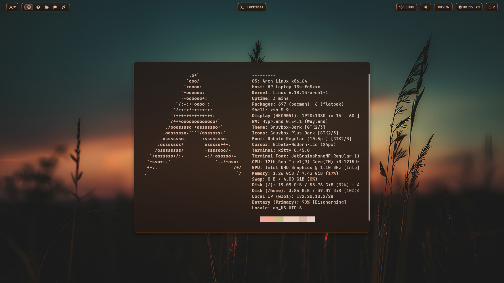

# dotspace ✨  


**A modern Wayland dotfiles ecosystem for Arch Linux**

Minimal. Reproducible. Opinionated.  
Built for people who care about performance, aesthetics, and control.

---

## What is dotspace?

**dotspace** is a curated **Arch Linux dotfiles setup** designed around the modern **Wayland stack**.

It brings together:

- **Hyprland** – dynamic, smooth, and expressive
- **Niri** – scroll-based tiling for focused workflows
- **Waybar** – clean and informative status bar
- **Kitty** – fast GPU-accelerated terminal
- **Zsh** – a powerful interactive shell
-  Supporting CLI & Wayland tools

All packaged with **safe installers**, **automatic backups**, and **idempotent scripts**.

---

## Preview

<h3 align="center">Hyprland</h3>

<p align="center">
  <a href="assets/screenshots/hypr-1.png">
    
  </a>
  <a href="assets/screenshots/hypr-2.png">
    
  </a>
  <a href="assets/screenshots/hypr-3.png">
    
  </a>
</p>

<h3 align="center">Niri</h3>

<p align="center">
  <a href="assets/screenshots/niri.png">
    
  </a>
</p>

<p align="center">
  <sub>Click images to view full resolution</sub>
</p>

---

## Table of Contents

- [Preview](#preview)
- [Quick Start (Recommended)](#quick-start-recommended)
- [Manual Installation](#manual-installation)
  - [Install packages only](#install-packages-only)
  - [Install dotfiles only](#install-dotfiles-only)
  - [Recommended order (manual mode)](#recommended-order-manual-mode)
- [Features](#features)
- [Structure](#structure)
- [Package Management](#package-management)
- [Backup & Restore](#backup--restore)
- [Uninstall](#uninstall)
- [Notes](#notes)
- [License](#license)

---

## Quick Start (Recommended)

The fastest way to install everything.

```bash
git clone https://github.com/naushadansari-md/dotspace.git
cd dotspace
chmod +x setup.sh
./setup.sh
```
## Manual Installation

Use this method if you want full control over the installation process.

Ideal when:

- You want to inspect packages before installing

- You only want configs

- You only want packages

- You are debugging

- Install packages only

- Installs official Arch packages and AUR packages separately.

./install-packages.sh
| Option             | Description                                  |
| ------------------ | -------------------------------------------- |
| `--dry-run`        | Preview installation without making changes  |
| `--force`          | Reinstall packages even if already installed |
| `--aur-helper yay` | Manually specify AUR helper (`yay` / `paru`) |

Example
```bash
./install-packages.sh --dry-run
./install-packages.sh --aur-helper paru
```
stall dotfiles only

Creates symlinks and backs up existing configurations.
```bash
./install.sh
```
What it does:

- Creates symlinks under ~/.config

- Links .zshrc to ~/.zshrc

- Automatically backs up existing configs

- Skips already-linked files

- Safe to run multiple times

| Option      | Description                |
| ----------- | -------------------------- |
| `--dry-run` | Preview changes only       |
| `--force`   | Overwrite existing configs |

| Option      | Description                |
| ----------- | -------------------------- |
| `--dry-run` | Preview changes only       |
| `--force`   | Overwrite existing configs |


## Features

- Arch / Arch-based OS detection

- Automatic backup system before overwriting configs

- Idempotent install scripts (safe to re-run)

- Dry-run support for safe testing

- AUR helper auto-detection (yay / paru)

- Modular structure (packages and configs separated)

- Clean symlink management

- Home dotfile support (.zshrc)

- Reproducible environment setup


## Structure

```text
dotspace/
├── setup.sh
├── install.sh
├── install-packages.sh
├── packages/
│   ├── pkglist.txt
│   └── aur-pkglist.txt
├── scripts/
│   └── pkglist.sh
├── hypr/
├── niri/
├── waybar/
├── kitty/
├── zsh/
├── .zshrc
├── assets/
│   └── screenshots/
└── README.md
```
## Package Management

Generate package lists:
```bash
./scripts/pkglist.sh packages
```
Restore official packages:
```bash
sudo pacman -Syu --needed - < packages/pkglist.txt
```
Install AUR packages:
```bash
yay -S --needed - < packages/aur-pkglist.txt
```

## Backup & Restore
Before overwriting configs, backups are created automatically at:
```bash
~/.config-backup-YYYYMMDD-HHMMSS
```
To restore manually:
```bash
cp -r ~/.config-backup-YYYYMMDD-HHMMSS/* ~/.config/
```
## Uninstall
Remove linked configurations manually:
```bash
rm -rf ~/.config/hypr
rm -rf ~/.config/niri
rm -rf ~/.config/waybar
rm -rf ~/.config/kitty
rm ~/.zshrc
```
Then restore backup if necessary.

## License
MIT © Md Naushad

---
